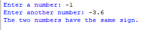
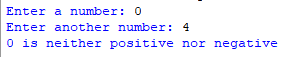
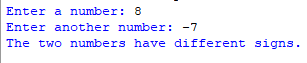

## Description 
This program determines whether two numbers entered by the user have the same sign, opposite signs, or if one of them is zero.
## Example
♡ Example 1   
  
♡ Example 2   
  
♡ Example 3    

